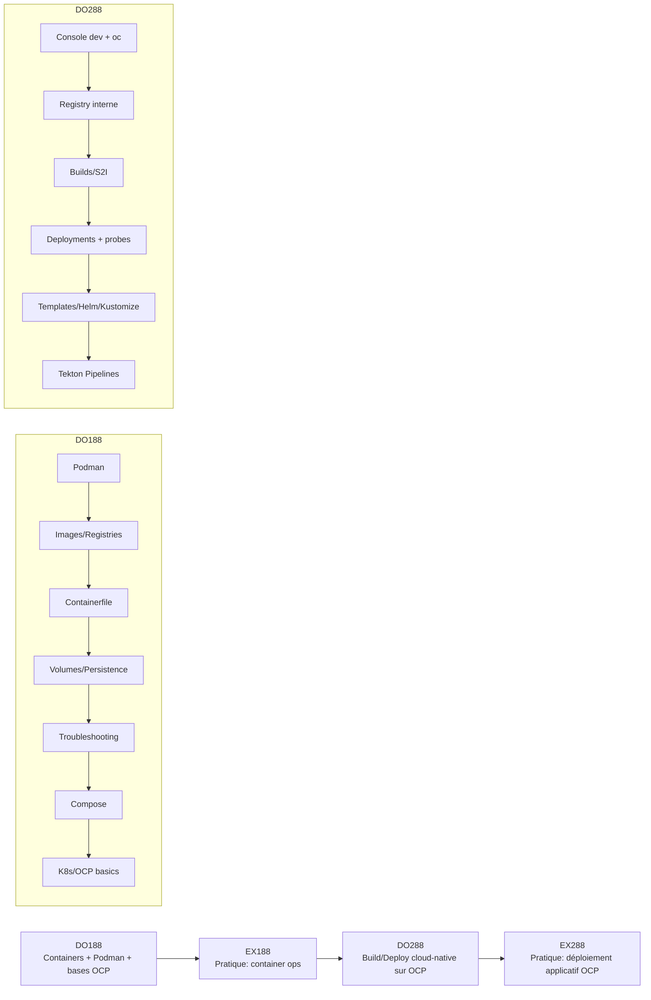

# Diagrammes — Vue d’ensemble du skills path



```mermaid
flowchart TB
  Dev[Code] -->|git push| Build[Build (S2I / Docker)\nBuildConfig]
  Build --> IS[ImageStream]
  IS --> Deploy[Deployment/DeploymentConfig]
  Deploy --> SVC[Service]
  SVC --> Route[Route]
  Route --> Users[Users]
```
