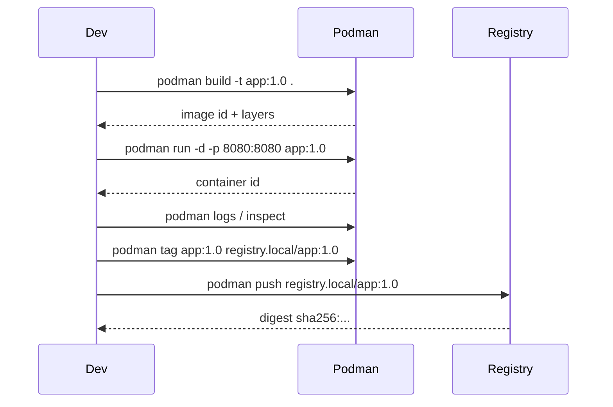

# Diagrammes — Cycle de vie container & image



```mermaid
flowchart LR
  SRC[Source code] --> CF[Containerfile]
  CF --> BUILD[Build layers]
  BUILD --> IMG[Image (tag/digest)]
  IMG --> RUN[Container runtime]
  RUN --> LOGS[Logs/events/inspect]
  RUN --> VOL[(Volume / Bind mount)]
```
