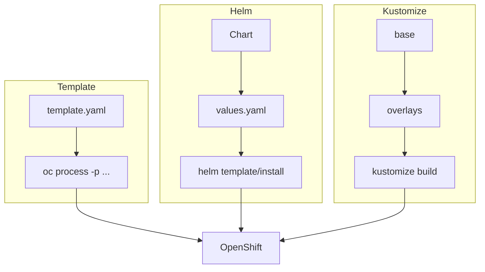

# M06 — Multi-container : Templates, Helm, Kustomize

## Objectifs
- Packager une même app sous 3 formes
- Paramétrer par environnement (values / overlays / parameters)
- Être capable de debug un rendu (render) et un déploiement

## Diagramme (comparaison)

